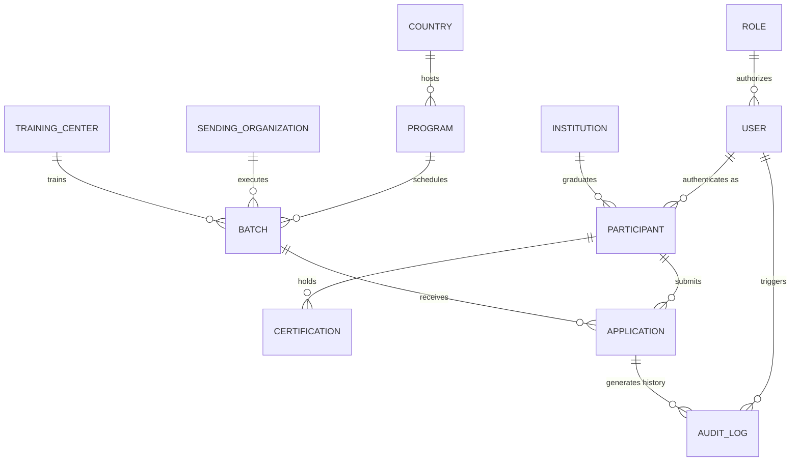

# Domain Model & Information Architecture Blueprint

**Platform:** International Internship Platform (Talenta Vokasi — Kemnaker RI)  
**Governing Authority:** Direktorat Bina Penyelenggaraan Pelatihan Vokasi dan Pemagangan, Ditjen Binalavotas  
**Phase:** Phase 2C — Domain Modeling & Information Architecture  
**Status:** SPECIFICATION ONLY (NO BACKEND / NO ORM / NO DATABASE CREATED)  
**Date:** September 2026  

---

## 1. Domain Overview & Enterprise Context

The International Internship Platform manages the end-to-end lifecycle of Indonesian vocational candidates pursuing official government-sanctioned apprenticeships abroad (such as the IM Japan G-to-G scheme, German Ausbildung Duale, South Korean technical internships, and Australian VET traineeships).

This document formally establishes the real-world domain model, business semantics, entity relationships, and validation constraints required before any backend or database engineering begins.

---

## 2. High-Level Entity Relationship Diagram (ERD)

---

## 3. Core Entity Specifications

### 3.1 Entity: Participant (Calon Peserta Magang)

- **Purpose:**  
  Represents an individual Indonesian vocational student, polytechnic alumnus, or certified jobseeker applying for an international apprenticeship program.
- **Business Description:**  
  The core subject of the platform. A Participant maintains a verified citizen profile, vocational educational background, health clearance records, and destination preferences.
- **Ownership:**  
  Belongs to the candidate for personal data; co-governed by Ditjen Binalavotas verification staff for official status verification.
- **Relationships:**
  - `Participant` → `User` (1 : 1, linked via foreign identifier)
  - `Participant` → `Institution` (N : 1, educational origin)
  - `Participant` → `Certification` (1 : N, language, skill, passport, and medical records)
  - `Participant` → `Application` (1 : N, can apply to successive batches if not currently placed)
- **Key Attributes:**
  - `id` (UUID)
  - `nik` (16-digit National Identity Number, unique)
  - `full_name` (Legal name matching Dukcapil/Passport)
  - `gender` (MALE | FEMALE)
  - `birth_date` (Date of birth)
  - `birth_place` (Regency / City)
  - `address_province` (Provincial code)
  - `address_regency` (Regency/City code)
  - `phone_number` (E.164 formatted WhatsApp contact)
  - `passport_number` (Optional during initial registration; mandatory before departure)
  - `passport_expiry_date` (Date)
  - `profile_status` (DRAFT | VERIFIED | SUSPENDED | BLACKLISTED)
- **Future Validation Rules:**
  - `nik` must strictly pass the Modulo-10 checksum and exist in the Dukcapil master registry.
  - Age must be between **18 and 28 years old** at the date of batch registration.
  - Candidate must not have an active, unresolved contract or departure ban in the Kemnaker migrant/trainee database.

---

### 3.2 Entity: Program (Skema Program Pemagangan)

- **Purpose:**  
  Defines an overarching bilateral apprenticeship scheme established between the Government of Indonesia and foreign governments or international associations.
- **Business Description:**  
  Encapsulates bilateral treaties, industry focus areas, statutory allowances, and sending guidelines (e.g., "IM Japan G-to-G Manufaktur", "Ausbildung Industri Jerman", "IA-CEPA Traineeship Australia").
- **Ownership:**  
  Owned exclusively by the Directorate of Apprenticeship (Direktorat Pemagangan Kemnaker RI).
- **Relationships:**
  - `Program` → `Country` (N : 1, destination nation)
  - `Program` → `Batch` (1 : N, programmatic execution waves)
- **Key Attributes:**
  - `id` (UUID)
  - `code` (Unique alphanumeric code, e.g., `PRG-JPN-IMJ`)
  - `title` (Formal program title)
  - `scheme_type` (G_TO_G | G_TO_P | P_TO_P | BILATERAL_VET)
  - `mou_reference_number` (Official treaty or decree reference)
  - `stipend_currency` (JPY, EUR, KRW, AUD, etc.)
  - `minimum_monthly_stipend` (Numeric minimum statutory allowance)
  - `editorial_status` (DRAFT | REVIEW | APPROVED | PUBLISHED | ARCHIVED)
  - `is_active` (Boolean flag)
- **Future Validation Rules:**
  - Cannot be set to `PUBLISHED` without an approved Echelon II decree reference (`mou_reference_number`).
  - Cannot be deleted if linked to active Batches or past participant alumni records.

---

### 3.3 Entity: Country (Negara Tujuan Penempatan)

- **Purpose:**  
  Maintains destination country records, diplomatic mission references, and legal jurisdictions.
- **Business Description:**  
  Defines the sovereign territory where trainees are placed. Contains consular jurisdiction references, visa categories, national minimum wage regulations, and bilateral risk indices.
- **Ownership:**  
  Governed by Kemnaker Biro Kerja Sama Luar Negeri (BKLN) in coordination with Kementerian Luar Negeri (Kemlu RI).
- **Relationships:**
  - `Country` → `Program` (1 : N, a country can host multiple internship programs)
- **Key Attributes:**
  - `id` (UUID or ISO 3-letter code, e.g., `JPN`, `DEU`, `KOR`, `AUS`)
  - `iso_code_2` (2-letter alpha code, e.g., `JP`, `DE`)
  - `name_id` (Indonesian name, e.g., "Jepang")
  - `name_en` (English diplomatic name)
  - `capital_city` (Capital city)
  - `consular_mission` (Supervising KBRI or KJRI)
  - `primary_language` (Primary required language)
  - `visa_type_category` (e.g., "Technical Intern Trainee / Tokutei Ginou")
  - `diplomatic_status` (ACTIVE | TRAVEL_ADVISORY | SUSPENDED)
- **Future Validation Rules:**
  - Code must strictly follow ISO 3166-1 alpha-3 standards.
  - If `diplomatic_status` changes to `SUSPENDED`, all pending departure batches to this country are automatically halted.

---

### 3.4 Entity: Batch (Gelombang / Angkatan Program)

- **Purpose:**  
  Represents a specific operational cohort and chronological timeline for candidate recruitment, selection, training, and departure.
- **Business Description:**  
  A time-boxed cycle of a Program. It has predefined participant quotas, registration deadlines, physical selection dates, training schedules, and departure windows.
- **Ownership:**  
  Managed by the designated Program Officer; ratified by the Director of Apprenticeship.
- **Relationships:**
  - `Batch` → `Program` (N : 1)
  - `Batch` → `Sending Organization` (N : M or N : 1)
  - `Batch` → `Training Center` (N : 1)
  - `Batch` → `Application` (1 : N)
- **Key Attributes:**
  - `id` (UUID)
  - `batch_number` (Integer / Alphanumeric, e.g., `BATCH-2026-02`)
  - `target_quota` (Target maximum trainees to be dispatched)
  - `registration_start_date` (Timestamp)
  - `registration_end_date` (Timestamp)
  - `selection_start_date` (Date)
  - `centralized_training_start_date` (Date)
  - `target_departure_date` (Date)
  - `batch_status` (UPCOMING | REGISTRATION_OPEN | SELECTION_IN_PROGRESS | TRAINING_IN_PROGRESS | DISPATCHED | COMPLETED)
- **Future Validation Rules:**
  - `registration_end_date` must precede `selection_start_date`.
  - Applications cannot be submitted once `registration_end_date` has elapsed.
  - Total accepted candidates cannot exceed `target_quota` without Echelon II written approval.

---

### 3.5 Entity: Application (Berkas Pendaftaran & Tahapan Seleksi)

- **Purpose:**  
  Tracks a single candidate's formal participation and stage progression within a specific Batch.
- **Business Description:**  
  The core state machine entity. Directly mirrors the **5-Stage Liveline Progression** showcased on the landing page:
  `1: Registrasi` ➔ `2: Seleksi` ➔ `3: Pelatihan` ➔ `4: Penempatan` ➔ `5: Evaluasi`.
- **Ownership:**  
  Jointly owned by the Participant and assigned Kemnaker / BPVP Verifiers.
- **Relationships:**
  - `Application` → `Participant` (N : 1)
  - `Application` → `Batch` (N : 1)
  - `Application` → `Audit Log` (1 : N, records every stage transition and score change)
- **Key Attributes:**
  - `id` (UUID / Application Number, e.g., `APP-2026-09-00124`)
  - `participant_id` (Foreign key)
  - `batch_id` (Foreign key)
  - `current_stage` (1 | 2 | 3 | 4 | 5)
  - `stage_status` (PENDING | IN_PROGRESS | PASSED | FAILED | ESCALATED)
  - `selection_physical_score` (Decimal, 0–100)
  - `selection_math_score` (Decimal, 0–100)
  - `selection_interview_score` (Decimal, 0–100)
  - `medical_checkup_result` (FIT | FIT_WITH_RESTRICTION | UNFIT)
  - `host_company_name` (Company in destination country, populated at Stage 4)
  - `host_company_prefecture` (Region/City in destination country)
  - `submitted_at` (Timestamp)
  - `completed_at` (Timestamp)
- **Future Validation Rules:**
  - A candidate can have at most **one active application** in `IN_PROGRESS` state across all programs.
  - Progression from Stage 1 to Stage 2 requires `stage_status === PASSED` and all mandatory documents verified.
  - Progression to Stage 4 (Penempatan) requires a valid Certificate of Eligibility (COE) and visa grant.

---

### 3.6 Entity: Institution (Lembaga Pendidikan Asal)

- **Purpose:**  
  Represents the secondary or higher educational institution where the candidate received their vocational foundation.
- **Business Description:**  
  Includes Vocational High Schools (SMK), State/Private Polytechnics (Politeknik), Universities, and Balai Latihan Kerja (BLK/BPVP).
- **Ownership:**  
  Master data synchronized with Kemendikbudristek (Dapodik / PDDikti) and Kemnaker SIAPkerja.
- **Relationships:**
  - `Institution` → `Participant` (1 : N)
- **Key Attributes:**
  - `id` (UUID)
  - `npsn_or_code` (Nomor Pokok Sekolah Nasional or Higher Ed Code)
  - `name` (Official institution name, e.g., "Politeknik Negeri Jakarta")
  - `institution_type` (SMK | POLITEKNIK | BLK_BPVP | UNIVERSITAS)
  - `accreditation_grade` (A | B | C | UNACCREDITED)
  - `province` (Province location)
  - `regency` (Regency location)
  - `is_vocational_partner` (Boolean flag for MoU partnership with Kemnaker)
- **Future Validation Rules:**
  - `npsn_or_code` must match active registries in PDDikti/Dapodik.
  - Candidates from institutions flagged as `is_vocational_partner` receive expedited institutional verification.

---

### 3.7 Entity: Sending Organization (Lembaga Pengirim / SO / LPK)

- **Purpose:**  
  Represents licensed third-party or bilateral sending entities responsible for preparation, preliminary language training, and logistical coordination.
- **Business Description:**  
  Lembaga Pelatihan Kerja (LPK) or Sending Organizations (SO) authorized under Minister of Manpower regulations (Permenaker) to organize sending of apprentices to Japan, Europe, or other regions.
- **Ownership:**  
  Regulated and licensed by the Directorate of Apprenticeship (Direktorat Pemagangan Kemnaker RI).
- **Relationships:**
  - `Sending Organization` → `Batch` (1 : N)
- **Key Attributes:**
  - `id` (UUID)
  - `license_number` (Nomor Izin SO/LPK Kemnaker, e.g., `KEP.240/LAVOTAS/2024`)
  - `organization_name` (Legal entity name, PT or Yayasan)
  - `brand_name` (Public trade name)
  - `pic_name` (Person-in-Charge / Director)
  - `office_address` (Headquarters address)
  - `license_expiry_date` (Date)
  - `accreditation_status` (ACCREDITED | PROBATION | REVOKED | EXPIRED)
- **Future Validation Rules:**
  - An SO with `accreditation_status !== ACCREDITED` cannot be assigned to new program Batches.
  - License must be renewed every 3 years in accordance with ministerial regulations.

---

### 3.8 Entity: Training Center (Pusat Pelatihan Terpusat / BPVP)

- **Purpose:**  
  Represents government-owned or accredited residential training campuses where Stage 3 (Pelatihan Terpusat) is conducted.
- **Business Description:**  
  Balai Besar Pelatihan Vokasi dan Produktivitas (BBPVP/BPVP) facilities across Indonesia (e.g., BBPVP Bandung, BBPVP Serang, BBPVP Semarang, BBPVP Medan) providing boarding, cultural orientation, physical discipline, and intensive language immersion before departure.
- **Ownership:**  
  Operated directly by Ditjen Binalavotas Kemnaker RI.
- **Relationships:**
  - `Training Center` → `Batch` (1 : N)
- **Key Attributes:**
  - `id` (UUID)
  - `bpvp_code` (e.g., `BBPVP-BDG-01`)
  - `name` (e.g., "Balai Besar Pelatihan Vokasi dan Produktivitas Bandung")
  - `city` (Bandung)
  - `dormitory_bed_capacity` (Integer)
  - `language_lab_capacity` (Integer)
  - `head_of_center_nip` (NIP of government echelon official)
- **Future Validation Rules:**
  - Batch candidate allocations cannot exceed `dormitory_bed_capacity`.

---

### 3.9 Entity: Certification (Sertifikasi & Kelengkapan Berkas)

- **Purpose:**  
  Maintains validated credentials, language proficiency certificates, medical examination clearances, and vocational competency licenses held by a participant.
- **Business Description:**  
  Evidence records submitted during Stage 1 and Stage 3. Examples: JLPT N4 / NAT-TEST 4Q for Japan, Goethe-Zertifikat B1 for Germany, BNSP SKKNI level certifications, and fit-to-work medical dossiers.
- **Ownership:**  
  Uploaded by Participant; authenticated by Kemnaker Verifiers or testing body API feeds.
- **Relationships:**
  - `Certification` → `Participant` (N : 1)
- **Key Attributes:**
  - `id` (UUID)
  - `participant_id` (Foreign key)
  - `certification_type` (LANGUAGE | VOCATIONAL_SKILL | MEDICAL_CLEARANCE | PASSPORT | POLICE_CLEARANCE_SKCK)
  - `issuer_name` (e.g., "The Japan Foundation", "Goethe-Institut", "RSUD Pasar Rebo")
  - `certificate_number` (Alphanumeric identifier)
  - `score_or_grade` (e.g., "124/180", "JLPT N4", "Fit")
  - `issued_date` (Date)
  - `expiry_date` (Date, nullable)
  - `verification_status` (PENDING | VERIFIED | REJECTED | FORGED_FRAUD)
  - `document_file_url` (Secure object storage URI at PDN)
- **Future Validation Rules:**
  - For Japanese G-to-G, language certificate must be JLPT N4 minimum or certified equivalent.
  - Medical clearance must be dated within **6 months** of the batch departure date.

---

### 3.10 Entity: User (Akun Pengguna Sistem)

- **Purpose:**  
  Represents authenticated identity credentials and system access accounts.
- **Business Description:**  
  The authentication subject mapped from SIAPkerja SSO or created for internal administrative staff.
- **Ownership:**  
  Managed by Kemnaker Pusat Data dan Teknologi Informasi (Pusdatin).
- **Relationships:**
  - `User` → `Role` (N : 1 or N : M)
  - `User` → `Participant` (1 : 1, if user role is candidate)
  - `User` → `Audit Log` (1 : N)
- **Key Attributes:**
  - `id` (UUID)
  - `siapkerja_uuid` (External federated identifier)
  - `email` (Unique work email or candidate email)
  - `nik` (16-digit identifier)
  - `full_name` (Name)
  - `role_id` (Foreign key)
  - `is_active` (Boolean)
  - `last_login_at` (Timestamp)
  - `created_at` (Timestamp)
- **Future Validation Rules:**
  - Email domain for administrative verifiers must belong to `@kemnaker.go.id`.
  - Session tokens expire after 60 minutes of inactivity.

---

### 3.11 Entity: Role (Peran Akses & Otorisasi RBAC)

- **Purpose:**  
  Defines permission scopes and operational capabilities within the application.
- **Business Description:**  
  Enforces administrative boundaries separating candidates, field verifiers, selection committees, echelon directors, and system administrators.
- **Ownership:**  
  Governed by Kemnaker IT Security Policy.
- **Relationships:**
  - `Role` → `User` (1 : N)
- **Key Attributes:**
  - `id` (UUID)
  - `code` (CALON_PESERTA | VERIFIKATOR_BPVP | TIM_SELEKSI | DIREKTUR_ESELON_II | SUPERADMIN_IT)
  - `name` (Human-readable name)
  - `permissions_json` (Array of permission keys, e.g., `["participants:read", "dossier:verify", "quotas:approve"]`)
- **Future Validation Rules:**
  - Administrative roles cannot be assigned to public candidates.
  - Approving program dossiers requires explicit `quotas:approve` permission.

---

### 3.12 Entity: Audit Log (Jejak Rekam & Integritas Forensik)

- **Purpose:**  
  Provides an immutable, tamper-evident chronological ledger of all substantive state changes.
- **Business Description:**  
  Records who modified what, when, and why. Crucial for government accountability during national selection rounds, candidate disqualifications, score inputs, and bilateral quota approvals.
- **Ownership:**  
  Read-only system table; monitored by Biro Hukum & Inspektorat Jenderal Kemnaker RI.
- **Relationships:**
  - `Audit Log` → `User` (N : 1)
  - `Audit Log` → `Application` (N : 1, nullable)
- **Key Attributes:**
  - `id` (UUID)
  - `actor_user_id` (UUID of the user executing the action)
  - `actor_ip_address` (Client IP)
  - `action_type` (CREATE | UPDATE | DELETE | STATUS_TRANSITION | SCORE_INPUT | APPROVAL)
  - `entity_name` (e.g., "Application", "Program", "Batch")
  - `entity_id` (Identifier of modified entity)
  - `before_state_json` (Snapshot prior to mutation)
  - `after_state_json` (Snapshot following mutation)
  - `justification_note` (Mandatory note explaining why a score or stage was modified)
  - `timestamp` (Timestamp with microsecond precision)
  - `hash_signature` (Cryptographic HMAC signature verifying log immutability)
- **Future Validation Rules:**
  - Audit log entries are strictly **append-only** (zero `UPDATE` or `DELETE` permitted, even by superadmins).
  - Every candidate score override or stage failure decision must include a non-empty `justification_note`.
