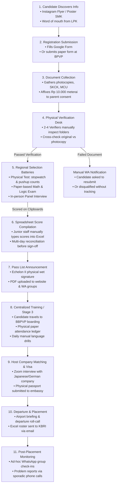

# Manual Process Map: Candidate Lifecycle (As-Is Reality)

**Entity:** Direktorat Bina Penyelenggaraan Pelatihan Vokasi dan Pemagangan, Ditjen Binalavotas, Kemnaker RI  
**Phase:** Phase 2E — Real Operational Workflow Discovery  
**Purpose:** Mapping the physical, paper-based, and spreadsheet-driven lifecycle of an international internship candidate today.  
**Date:** September 2026  

---

## 1. End-to-End Operational Lifecycle Map

The diagram below reflects the actual sequential journey of candidate intake, physical testing, and departure as practiced today:

---

## 2. Granular Stage-by-Stage Operational Walkthrough

### 2.1 Stage 1: Registration (Pendaftaran Awal)
- **Candidate Experience:**
  - Candidate sees a Canva infographic flyer on an Instagram feed (`@kemnaker` or `@bbpvp_bandung`) or receives a forwarded image in an alumni WhatsApp group.
  - Link in bio directs to an unbranded Google Form or Bitly URL (`bit.ly/MagangJepang2026-Batch2`).
  - Candidate types identity data on mobile phone. Uploads scanned files or phone camera photos into Google Drive upload fields.
- **Back-Office Reality:**
  - Google Sheet linked to the Google Form accumulates raw responses.
  - Candidate phone camera uploads vary wildly: blurry photos, unrotated JPEGs, files titled `Screenshot_20260928-101142.png`, or missing pages.
  - Storage quota warnings: Google Drive shared folders run out of storage space mid-registration, causing candidate uploads to fail until staff manually clears space or purchases additional storage.

---

### 2.2 Stage 2: Document Collection & Physical Filing (Pemberkasan Fisik)
- **Candidate Action:**
  - Candidate travels to the regional BPVP or submits a physical dossier folder (*map snelhefter folio: merah untuk putra, kuning untuk putri*) to an accredited LPK.
- **Physical Contents of the Folder:**
  - 2 photocopies of legalized SMK/Polytechnic diploma (*legalisir cap basah*).
  - 2 photocopies of Kartu Tanda Penduduk (e-KTP) and Kartu Keluarga (KK).
  - 1 original Surat Keterangan Catatan Kepolisian (SKCK) for international travel.
  - 1 original Surat Izin Orang Tua / Wali / Pasangan with wet ink signature on Rp 10.000 meterai.
  - 1 original Medical Check-Up (MCU) certificate from an accredited hospital/laboratory.
  - 4 physical 3x4 and 4x6 passport-style photographs with red background.
- **Storage Reality:**
  - Hundreds of physical folders are stacked in cardboard archive boxes in BPVP office corners.

---

### 2.3 Stage 3: Verification Desk (Pemeriksaan & Validasi Berkas)
- **Verifiers' Routine:**
  - 2 to 4 staff members sit at folding tables in a gymnasium or auditorium.
  - Staff picks up folder by folder, ticking paper verification checklists.
  - Visual inspection: Verifier holds diploma photocopy up to light to check authenticity; compares spelling of candidate name between KTP, Akta Kelahiran, and Diploma.
  - Medical report scrutiny: Verifier checks laboratory printout for blood test results (HBsAg, VDRL, HIV), chest X-ray findings (*foto toraks*), and Ishihara color blindness plates.
- **Handling Discrepancies:**
  - If a document is missing or illegible, staff writes the candidate's mobile number on a sticky note.
  - Staff manually sends a WhatsApp chat from a personal smartphone: *"Selamat siang Dik, berkas SKCK belum dilegalisir, tolong diantar ke balai sebelum jam 4 sore ya."*
  - High risk of lost sticky notes and unrecorded candidate updates.

---

### 2.4 Stage 4: Selection Testing (Pelaksanaan Seleksi Fisik & Akademik)
- **Day 1: Physical Fitness Examination (Tes Kesamaptaan / Fisik):**
  - Held on BPVP sports fields or military training grounds (with TNI/Polri instructors).
  - Push-ups: 35 reps minimum (counted verbally; recorded on paper clipboards).
  - Sit-ups: 35 reps minimum (recorded on paper clipboards).
  - 3,000-meter run: Timed with manual hand stopwatches. Staff writes finish times with pencils on water-stained paper sheets.
- **Day 2: Basic Mathematics & Logic Exam (Tes Matematika Dasar):**
  - Candidates sit in examination halls with printed paper exam sheets (20 arithmetic questions in 15 minutes).
  - Staff manually grades answers using cardboard scoring stencils (*kunci jawaban berlubang*).
- **Day 3: Panel Interview (Wawancara & Minat Bakat):**
  - Panellists (1 Kemnaker official + 1 IM Japan/Partner representative + 1 Japanese language instructor) question candidates.
  - Scores (A, B, C or 0–100) are handwritten on scoring paper rubrics.

---

### 2.5 Stage 5: Score Compilation & Decree Drafting (Rekapitulasi Nilai & SK Penetapan)
- **Data Entry Bottleneck:**
  - A junior staff member collects paper scoring rubrics from all examiners.
  - Manually transcribes hundreds of handwritten test scores into a master Excel file: `Rekap_Nilai_Seleksi_Batch_II_2026.xlsx`.
  - Manual Excel formulas (`=AVERAGE`, `=IF(AND(...)`, `LULUS`, `TIDAK LULUS`) calculate eligibility rankings.
  - Typo hazards: A single transposition error (e.g., entering `58` instead of `85`) can accidentally disqualify a qualified candidate.
- **Approval Circulation (Nota Dinas):**
  - Staff prints out a 30-page draft decree (*Surat Keputusan Direktur tentang Penetapan Kelulusan Seleksi*).
  - File physically circulates through routing slips: Staff ➔ Subkoordinator ➔ Koordinator ➔ Direktur Eselon II.
  - If Direktur is attending an official working trip (*perjalanan dinas luar kota*), the paper folder sits on their desk for **3 to 5 working days** before receiving a wet ink signature (*tanda tangan basah*) and ministerial rubber stamp (*stempel dinas*).

---

### 2.6 Stage 6: Centralized Training & Language Immersion (Pelatihan Terpusat di BPVP)
- **Intake & Boarding:**
  - Selected candidates report to BBPVP dormitory facilities (e.g., BBPVP Bandung or BBPVP Serang) for 2 to 3 months of residential boarding.
  - Intake attendance recorded in physical ledger binders.
- **Daily Curriculum:**
  - Morning physical training at 05:00 WIB.
  - 8 hours daily of foreign language immersion (Japanese Hiragana, Katakana, Kanji, Kaiwa; or German A1/B1).
  - Weekly test scores tracked on instructors' individual laptops.
- **Attrition Handling:**
  - Candidates who drop out due to illness, homesickness, or disciplinary violations are recorded manually. Notification to central Kemnaker is often delayed by days.

---

### 2.7 Stage 7: Host Company Matching & Visa Issuance (Penempatan & Pemberkasan Visa)
- **Matching Process:**
  - Sending Organizations (SO) and foreign receiving bodies (AO) circulate resumes (*rirekisho*) to host companies in Japan/Europe.
  - Interviews conducted via Zoom/Google Meet arranged over email threads.
- **Visa & Passport Processing:**
  - When candidate is accepted, physical passports are collected and transported in courier bags to embassies/consulates.
  - Certificate of Eligibility (COE) arrives via physical airmail from foreign immigration bureaus.
  - Staff types dispatch rosters into Excel to prepare exit permits (*Surat Rekomendasi Bebas Fiskal / Rekomendasi Visa Pemagangan*).

---

### 2.8 Stage 8: Post-Placement Monitoring (Pemantauan di Luar Negeri)
- **Monitoring Reality:**
  - No automated tracking system exists once the candidate arrives in Tokyo, Frankfurt, or Seoul.
  - Monitoring relies on informal WhatsApp groups created by alumni or SO managers (*"Anak-anak Magang Aichi 2026"*).
  - Critical incidents (accidents, unpaid allowances, runaways/*kabur*) are only discovered when family members panic and contact local BPVP balai or when the Indonesian Embassy (KBRI) sends an official diplomatic dispatch (*Kawat Diplomatik*) to Kemnaker.
