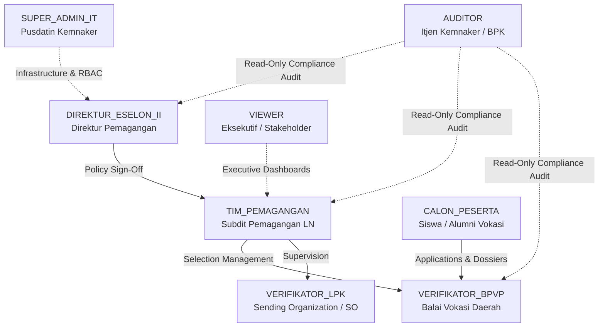

# Role-Based Access Control (RBAC) Architecture

**Platform:** International Internship Platform (Talenta Vokasi — Kemnaker RI)  
**Governing Authority:** Kementerian Ketenagakerjaan Republik Indonesia (Kemnaker RI)  
**Implementing Directorate:** Direktorat Jenderal Pembinaan Pelatihan Vokasi dan Produktivitas (Binalavotas)  
**Phase:** Phase 2D — Role, Permission, and Access Modeling  
**Status:** SPECIFICATION ONLY (NO CODE / NO DATABASE CREATED)  
**Date:** September 2026  

---

## 1. Executive Summary & Authorization Principles

This document establishes the comprehensive Role-Based Access Control (RBAC) architecture for the **International Internship Platform**. The authorization structure enforces:
1. **Principle of Least Privilege:** Every role receives the minimum operational scope necessary to fulfill its official mandate.
2. **Separation of Duties (SoD):** High-stakes actions (such as score overrides, quota ratifications, and program suspensions) require segregation across organizational roles.
3. **Four-Eyes Principle:** No individual user can author, review, and formally approve a regulatory decree or participant stage advancement independently.

---

## 2. Global Role Hierarchy

---

## 3. Comprehensive Role Definitions

### 3.1 Role: `SUPER_ADMIN_IT`

- **Purpose:**  
  Maintains system infrastructure, Single Sign-On (SSO) integrations, database replication health, role assignment security, and disaster recovery.
- **Responsibilities:**
  - Manages SIAPkerja OpenID Connect (OIDC) identity provider endpoints and cryptographic keys.
  - Monitors system availability, network latency, and Pusat Data Nasional (PDN) cloud resource allocation.
  - Provisions administrative accounts for Ministry personnel following formal Nota Dinas approval.
  - Conducts technical maintenance, log archive maintenance, and security patch verification.
- **Allowed Actions:**
  - Full read/write access to system settings, API gateway rate limits, and identity provider configurations.
  - Read access to technical audit logs, infrastructure metrics, and system diagnostics.
  - Ability to terminate active user sessions and force passwordless credential resets via SIAPkerja.
- **Restricted Actions:**
  - **STRICTLY FORBIDDEN** from modifying candidate selection scores, interview grades, or medical results.
  - Cannot approve program quotas, sign off on bilateral decrees, or modify dispatch candidate lists.
  - Cannot author public portal articles or modify editorial texts.
- **Approval Authority:**  
  Technical configurations only. Zero substantive program or participant approval authority.
- **Escalation Path:**  
  Reports to the Kepala Pusat Data dan Teknologi Informasi (Pusdatin Kemnaker RI).

---

### 3.2 Role: `DIREKTUR_ESELON_II`

- **Purpose:**  
  Highest substantive executive authority governing international vocational apprenticeships.
- **Responsibilities:**
  - Formally ratifies international bilateral cooperation programs and sending quotas.
  - Validates and signs participant dispatch decrees (Surat Keputusan Penetapan Peserta Magang Luar Negeri) using official BSrE digital certificates.
  - Authorizes national selection committee schedules and BPVP training center allocations.
  - Executes emergency program suspensions upon receiving diplomatic advisories from Kemlu.
- **Allowed Actions:**
  - Full approval/rejection authority over Programs, Batches, and National Quotas.
  - Authority to issue emergency kill-switch suspensions on country batches.
  - Read access across all candidate dossiers, selection rankings, and audit logs.
  - Ability to request re-evaluation of candidate batches from selection committees.
- **Restricted Actions:**
  - Cannot enter raw candidate physical/math scores (delegated to field selection panels).
  - Cannot alter technical infrastructure parameters or SSO client secrets.
  - Cannot bypass statutory minimum wage floors established under bilateral treaties.
- **Approval Authority:**  
  Final approving authority for Program Publication, National Quota Allocations, Final Dispatches, and Emergency Halts.
- **Escalation Path:**  
  Reports to the Direktur Jenderal Pembinaan Pelatihan Vokasi dan Produktivitas (Dirjen Binalavotas / Eselon I).

---

### 3.3 Role: `TIM_PEMAGANGAN`

- **Purpose:**  
  Central operations team within the Directorate of Apprenticeship managing day-to-day coordination between international partners, regional BPVP balai, and sending organizations.
- **Responsibilities:**
  - Drafts program briefs, eligibility criteria, and batch schedules for Echelon II review.
  - Coordinates bilateral partner requirements (e.g., IM Japan, German Chambers, Korean associations).
  - Oversees candidate progression through the 5-Stage Liveline.
  - Verifies Sending Organization (SO/LPK) licensing status and compliance standings.
- **Allowed Actions:**
  - Create and edit draft Programs, destination Countries, and recruitment Batches.
  - Monitor applicant volume, regional quotas, and selection timelines.
  - Advance or flag applications requiring special administrative clearance.
  - Generate consolidated national reporting briefs and dispatch dossiers.
- **Restricted Actions:**
  - Cannot give final unilateral approval to publish programs to the public portal without Echelon II sign-off.
  - Cannot unilaterally revoke sending organization licenses (requires formal ministerial decree).
- **Approval Authority:**  
  Reviews and recommends Program Batches and quota proposals for Echelon II sign-off.
- **Escalation Path:**  
  Reports to the Koordinator Penyelenggaraan Pemagangan Luar Negeri / Direktur Pemagangan.

---

### 3.4 Role: `VERIFIKATOR_BPVP`

- **Purpose:**  
  Regional operational staff stationed at Balai Besar Pelatihan Vokasi dan Produktivitas (BBPVP/BPVP) responsible for candidate dossier validation, physical selection scoring, and Stage 3 residential training monitoring.
- **Responsibilities:**
  - Reviews candidate document uploads during Stage 1 (e-KTP, diploma, parent consent, SKCK, medical statement).
  - Records physical agility scores, basic mathematics/logic test scores, and interview ratings during Stage 2.
  - Manages residential boarding intake and attendance records at centralized training facilities (Stage 3).
  - Flags suspicious or counterfeit documents (e.g., forged diplomas or altered language certificates).
- **Allowed Actions:**
  - Mark candidate documents as `VERIFIED`, `REJECTED`, or `FORGED_FRAUD`.
  - Enter and submit selection test scores within authorized testing time windows.
  - Add verification notes and escalate problematic applications to central Tim Pemagangan.
  - View candidate dossiers within their designated regional jurisdiction.
- **Restricted Actions:**
  - **STRICTLY FORBIDDEN** from viewing or modifying candidate records outside assigned regional BPVP jurisdiction.
  - Cannot modify selection scores once officially submitted without written Echelon II justification.
  - Cannot alter batch quotas or registration deadlines.
- **Approval Authority:**  
  Pass/fail determination on individual candidate Stage 1 documents and Stage 2 test batteries.
- **Escalation Path:**  
  Reports to the Kepala Balai Pelatihan Vokasi dan Produktivitas (BPVP) and central Tim Pemagangan.

---

### 3.5 Role: `VERIFIKATOR_LPK`

- **Purpose:**  
  Accredited Sending Organization (SO) or Lembaga Pelatihan Kerja (LPK) administrative representative.
- **Responsibilities:**
  - Monitors the training and document readiness of candidates sponsored or trained under their accredited institution.
  - Uploads preliminary language immersion certificates (e.g., JLPT N4 / NAT-TEST) and pre-departure medical files.
  - Coordinates host company interview schedules during Stage 4 (Penempatan).
- **Allowed Actions:**
  - View the stage status and non-sensitive milestone history of candidates bound to their SO license.
  - Upload pre-departure logistics documents (visa applications, flight itineraries, Certificate of Eligibility / COE).
  - Receive automated notifications regarding selection results and departure briefings.
- **Restricted Actions:**
  - **CANNOT** view candidate dossiers belonging to competing sending organizations.
  - Cannot evaluate, score, or alter candidate selection grades.
  - Cannot modify program terms, statutory stipends, or dispatch quotas.
- **Approval Authority:**  
  Zero government approval authority. Submission and logistics coordination only.
- **Escalation Path:**  
  Reports to the central Tim Pemagangan (Subdit Pengawasan Lembaga Pengirim).

---

### 3.6 Role: `AUDITOR`

- **Purpose:**  
  Independent oversight role assigned to Inspektorat Jenderal (Itjen Kemnaker), Badan Pemeriksa Keuangan (BPK), or Badan Pengawasan Keuangan dan Pembangunan (BPKP).
- **Responsibilities:**
  - Verifies public selection fairness, quota adherence, and anti-bribery/anti-fraud compliance.
  - Audits chronological state transitions and inspects score alteration justifications.
  - Evaluates institutional performance and Sending Organization compliance indices.
- **Allowed Actions:**
  - Read-only access across all candidate records, test scores, program decrees, and statistical ledgers.
  - Full access to the immutable `Audit Log` table, including before/after state diffs and IP addresses.
  - Authority to export forensic audit datasets for official compliance reviews.
- **Restricted Actions:**
  - **ZERO WRITE OR MUTATION ACCESS.** Cannot alter candidate records, change scores, approve programs, or modify system settings.
- **Approval Authority:**  
  Zero operational approval authority. Independent reporting authority to the Menteri Ketenagakerjaan.
- **Escalation Path:**  
  Reports to the Inspektur Jenderal Kemnaker RI / Pimpinan BPK RI.

---

### 3.7 Role: `VIEWER`

- **Purpose:**  
  Read-only analytical access for ministerial executive leadership, cross-ministry liaisons (Kemlu, Kemendikbudristek), and bilateral partner embassies.
- **Responsibilities:**
  - Monitors national dispatch progress, regional representation, and vocational competency outcomes.
  - Reviews high-level analytics dashboards and program reports without granular PII exposure.
- **Allowed Actions:**
  - View aggregated statistical preview dashboards and program catalog overviews.
  - Inspect approved bilateral quotas and active cohort timelines.
- **Restricted Actions:**
  - Cannot view unmasked candidate Personal Identifiable Information (PII) such as full NIK or home addresses.
  - Zero write, edit, or approval capabilities.
- **Approval Authority:**  
  None.
- **Escalation Path:**  
  N/A (Read-only consumer).

---

### 3.8 Role: `CALON_PESERTA`

- **Purpose:**  
  Individual Indonesian vocational candidate seeking international internship opportunities.
- **Responsibilities:**
  - Completes personal demographic profile and educational history.
  - Uploads verified documents (KTP, diploma, parent consent, SKCK, medical certificates).
  - Tracks individual application progression across the 5 stages of the Liveline.
  - Attends scheduled physical tests, interviews, and residential centralized training.
- **Allowed Actions:**
  - View published Programs, open Batches, and destination Country guides.
  - Submit, edit, or withdraw their own single active Application during open registration windows.
  - Upload credential files and view their own test results and stage progression.
- **Restricted Actions:**
  - **STRICTLY ISOLATED** from all other candidate profiles, internal verifier notes, and administrative dashboards.
  - Cannot apply to multiple batches concurrently.
  - Cannot modify application documents once a stage has entered `IN_PROGRESS` verification.
- **Approval Authority:**  
  Self-attestation of submitted documents only.
- **Escalation Path:**  
  Assistance through official Kemnaker Helpdesk / BPVP Regional Call Center.
