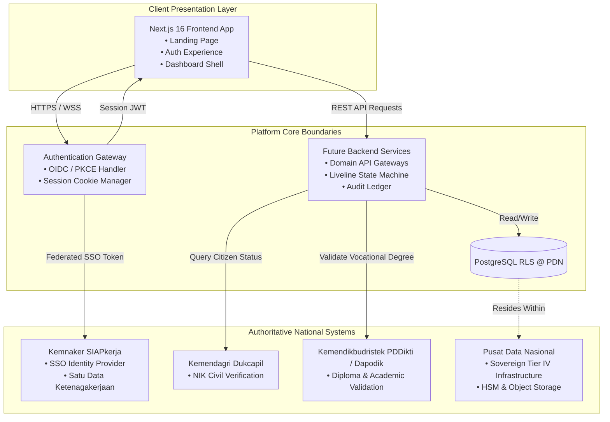

# System Boundaries & External Integrations Architecture

**Platform:** International Internship Platform (Talenta Vokasi — Kemnaker RI)  
**Governing Authority:** Kementerian Ketenagakerjaan Republik Indonesia  
**Phase:** Phase 2C — Domain Modeling & Information Architecture  
**Status:** SPECIFICATION ONLY (NO CODE / NO DB CREATED)  
**Date:** September 2026  

---

## 1. Executive Summary & C4 System Context

This document demarcates the strict architectural boundaries between the **Frontend Presentation Layer**, the **Authentication Gateway**, the **Future Backend Microservices**, and authoritative **External Government Systems**.

Establishing these boundaries guarantees that:
1. The frontend remains decoupled, resilient, and responsive.
2. Sensitive personal data (PII) is isolated within compliant sovereign boundaries.
3. Integration points with national infrastructure (**SIAPkerja**, **Dukcapil**, **PDDikti**, **PDN**) have documented data contracts before implementation.

---

## 2. System Context Diagram (C4 Level 1)



---

## 3. Boundary Breakdown

### 3.1 What Belongs to the Frontend (Kewenangan Frontend)

The Frontend represents the user-facing web application built with Next.js 16 (Turbopack), React 19, and Tailwind CSS:

- **Responsibilities:**
  - Route navigation and layouts (`/`, `/login`, `/dashboard`, `/participants`, `/programs`, `/reports`, `/settings`).
  - High-performance UI rendering (architectural aesthetics, responsive drawer, sticky card stacking, and Lenis smooth scrolling).
  - WAI-ARIA tab navigation, focus indicators, and screen reader announcements.
  - Interactive stage visualization via the **Liveline** component.
  - Form validation on the client side (regex formatting, mandatory input checks, one-time code inputs via `input-otp`).
  - Toast feedback dispatching via `Sonner`.
  - Client-side dataset virtualization via `react-virtuoso` (windowed table rendering).
- **Explicit Exclusions (What the Frontend Must NOT Do):**
  - Storing unmasked participant credentials in local browser storage (`localStorage` or `sessionStorage`).
  - Making raw database queries or calculating cryptographic audit signatures.
  - Performing authoritative eligibility judgments (all selection decisions belong to the backend).

---

### 3.2 What Belongs to Authentication (Kewenangan Autentikasi)

The Authentication boundary acts as the security perimeter between the frontend client and the ministerial identity provider:

- **Responsibilities:**
  - Facilitating the OAuth 2.0 / OpenID Connect (OIDC) handshake with PKCE (Proof Key for Code Exchange).
  - Validating digital signatures of incoming identity tokens (ID Tokens) issued by SIAPkerja.
  - Minting and rotating secure, encrypted, `HttpOnly`, `SameSite=Lax`, `Secure` session cookies.
  - Parsing user roles (`CALON_PESERTA`, `VERIFIKATOR_BPVP`, `DIREKTUR_ESELON_II`, `SUPERADMIN_IT`) and injecting claims into the downstream request context.
  - Managing in-memory simulated fallback states during demonstration phases (Phase 2A/2B).
  - Enforcing session inactivity timeouts (60 minutes for candidates, 30 minutes for administrative personnel).

---

### 3.3 What Belongs to the Future Backend (Kewenangan Backend Masa Depan)

The Backend encompasses the domain microservices, business rules engine, and persistent storage:

- **Responsibilities:**
  - **Participants Service:** CRUD operations, candidate profile lifecycle, document upload encryption, and resume parsing.
  - **Liveline State Machine Service:** Managing the sequential progression of candidates across Stages 1 through 5, ensuring stage gates are not bypassed without prerequisite scores.
  - **Selection Engine:** Processing physical agility scores, logic test results, and medical examination classifications.
  - **Batch & Program Service:** Managing country profiles, bilateral MoU quotas, and echelon sign-off workflows.
  - **Audit & Forensic Logging Service:** Writing immutable append-only transaction logs with HMAC cryptographic chaining.
  - **Database Persistence:** PostgreSQL database utilizing Row-Level Security (RLS) to ensure tenant and regional BPVP data isolation.

---

### 3.4 What Belongs to External Systems (Sistem Eksternal Nasional)

#### 3.4.1 Kemnaker SIAPkerja (Sistem Informasi dan Pelayanan Ketenagakerjaan)
- **Role:** Authoritative Identity Provider (IdP) & National Labor Data Hub.
- **Data Exchanged:**
  - Candidate user profile (SIAPkerja UUID, email, verified mobile number).
  - National employment ID (Kartu AK/1 Pencari Kerja).
  - Historical overseas placement records to enforce the prior dispatch lockout rule.
- **Interface Protocol:** RESTful API over mTLS, OAuth 2.0 / OIDC Authorization Code Flow with PKCE.

#### 3.4.2 Kemendagri Dukcapil (Direktorat Jenderal Kependudukan dan Pencatatan Sipil)
- **Role:** National Civil Identity Registry.
- **Data Exchanged:**
  - Input: 16-digit NIK, Full Name, Date of Birth.
  - Output: Boolean match verification, active citizenship confirmation, biological sex verification, and registered family card (KK) number.
- **Interface Protocol:** Synchronous secure Web Service API (SOAP/REST) connected via private government VPN gateway (Jaringan Intra Pemerintah).
- **Security Mandate:** Raw population databases are never mirrored locally; queries are strictly transactional and verification-only.

#### 3.4.3 Kemendikbudristek PDDikti & Dapodik
- **Role:** Authoritative Educational Diploma Verifiers.
- **Data Exchanged:**
  - Input: School code (NPSN), Student Identification Number (NISN/NIM), Diploma serial number.
  - Output: Accredited graduation status, study program (Kejuruan/Jurusan), GPA, and graduation year.
- **Interface Protocol:** RESTful API over TLS 1.3 with API Key and mutual certificate authentication.

#### 3.4.4 Pusat Data Nasional (PDN)
- **Role:** Sovereign Hosting & Infrastructure Foundation.
- **Responsibilities:**
  - Sovereign cloud hosting within Tier IV government data center facilities (Cikarang / IKN).
  - Hardware Security Module (HSM) for cryptographic key storage and digital signature generation (BSrE BSSN).
  - Encrypted object storage (S3-compatible) for candidate identity documents, passport scans, and medical check-up PDFs.
  - Distributed firewall, DDoS mitigation, and Intrusion Prevention Systems (IPS) certified to ISO 27001.

---

## 4. Cross-Boundary Data Flow Matrix

| Transaction Flow | Source Boundary | Target Boundary | Protocol / Transport | Data Payload / Content | Fallback / Circuit Breaker Behavior |
| :--- | :--- | :--- | :--- | :--- | :--- |
| **User Sign-In** | Browser (Frontend) | SIAPkerja IdP | OIDC Authorization Code + PKCE | Auth Code, Client ID, Code Challenge | Redirect to error notice; fallback to manual login if SSO degraded |
| **Token Exchange** | Authentication Gateway | SIAPkerja Token Endpoint | HTTPS POST (Backchannel) | Auth Code, Code Verifier | 3-retry exponential backoff; logs failure to Audit Ledger |
| **NIK Verification** | Backend Participant Service | Dukcapil Gateway | HTTPS POST via Government VPN | NIK, Name, Birth Date | Queue application in `PENDING_MANUAL_VERIFICATION` if Dukcapil API times out |
| **Diploma Check** | Backend Participant Service | PDDikti / Dapodik API | HTTPS GET with API Key | NPSN, NIM, Diploma Serial | Flag dossier for manual verification by BPVP verifier |
| **File Storage** | Backend Service | PDN Encrypted Storage | HTTPS S3 API (SSE-KMS) | Binary document PDF/JPEG + SHA256 Hash | Return 503 upload failed; reject submission until file safely written |
| **Audit Ledger** | Any Backend Service | Database Audit Table | Internal PostgreSQL Connection | Append-only JSON transaction + HMAC signature | Critical failure: if audit write fails, transaction aborts immediately (Rollback) |

---

## 5. Security Architecture & Boundary Isolation

```
[PUBLIC INTERNET]
       │
       ▼  (WAF / Cloudflare Government Shield / DDoS Filter)
┌────────────────────────────────────────────────────────┐
│  FRONTEND PRESENTATION LAYER (DMZ Zone)                │
│  • Edge SSR & Static Pages @ Turbopack                 │
│  • Client In-Memory State Only                         │
└──────────────────────┬─────────────────────────────────┘
                       │  (Strict API Gateway Reverse Proxy)
                       ▼
┌────────────────────────────────────────────────────────┐
│  APPLICATION & BUSINESS LOGIC ZONE (Private VLAN)      │
│  • Backend Microservices                               │
│  • Liveline State Machine                              │
└──────────────────────┬─────────────────────────────────┘
                       │  (Encrypted Database Connection - mTLS)
                       ▼
┌────────────────────────────────────────────────────────┐
│  SECURE DATA SOVEREIGNTY ZONE (Pusat Data Nasional)    │
│  • PostgreSQL Database with Row-Level Security         │
│  • Encrypted Object Storage (AES-256)                  │
│  • BSSN Cryptographic HSM Ledger                       │
└────────────────────────────────────────────────────────┘
```

1. **DMZ Isolation:** The frontend presentation layer has zero direct visibility into private databases or external government APIs.
2. **Reverse Proxy Enforcement:** All client requests pass through a strictly rate-limited API gateway that inspects incoming payloads for SQL injection, XSS, and parameter tampering.
3. **Zero Trust Inter-Service Communication:** All communication between backend microservices and government data hubs operates across private VPN circuits with mutual TLS (mTLS) certificate verification.
