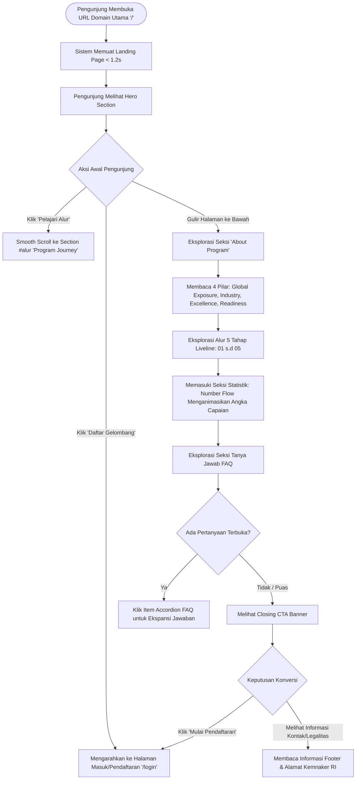
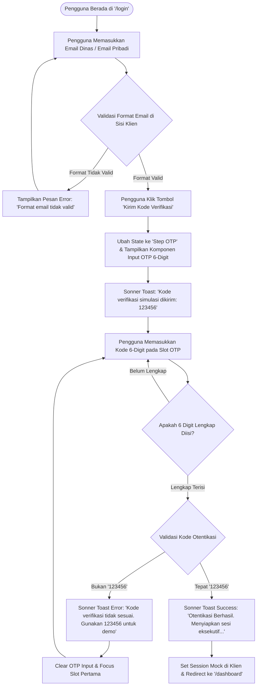

# Platform User Flow Architecture
## Platform Pemagangan Internasional – Direktorat Bina Talenta Vokasi
### Kementerian Ketenagakerjaan Republik Indonesia (Kemnaker RI)

---

| Dokumen ID | FLOW-VOKASI-INT-2026-V1 |
| :--- | :--- |
| **Status** | Approved Specification |
| **Penyusun** | Staff UX Engineer & Principal Product Designer |

---

## 1. Ikhtisar Alur Pengguna (Flow Overview)

Dokumen ini memetakan perjalanan pengalaman pengguna (*end-to-end user journeys*) untuk 3 skenario interaksi utama dalam platform Fase 1 PoC:
1. **Landing Visitor Flow**: Eksplorasi publik, pemahaman program vokasi, dan navigasi informasi.
2. **Admin / User Login Flow**: Masuk portal dengan otentikasi simulasi berbasis OTP 6-digit.
3. **Admin Dashboard Entry Flow**: Pengalihan sesi pasca login, validasi visual, dan eksplorasi ringkasan eksekutif.

---

## 2. Alur 01: Landing Visitor Flow (Eksplorasi Publik)

Alur ini dirancang untuk calon pemagang (alumni vokasi), pengajar, maupun perwakilan industri luar negeri yang mengunjungi portal untuk pertama kali.



### Karakteristik UX Seksi Landing:
- **Zero Friction Navigation**: Header sticky memberikan akses cepat ke anchor navigasi kapan pun pengguna ingin melompat antar topik.
- **Progressive Disclosure**: Konten FAQ dirancang bertingkat (*collapsible accordion*) agar tidak membebani ruang vertikal di layar ponsel.
- **Micro-Delight**: Perubahan angka (*rolling digit effect*) pada seksi statistik memicu efek kepuasan visual tanpa mengganggu fokus baca.

---

## 3. Alur 02: Admin & User Login Flow (Simulasi Otentikasi OTP)

Alur masuk tanpa kata sandi (*passwordless auth*) menggunakan One-Time Password (OTP) 6-digit. Alur ini memberikan standar keamanan setara sistem perbankan dan portal publik modern tanpa risiko kelupaan kata sandi.



### Penanganan Kasus Khusus (Edge Cases):
1. **Penyalinan Kode (Paste Support)**: Pengguna dapat menyalin (*copy-paste*) kode 6-digit langsung dari clipboard; komponen `input-otp` otomatis membagi karakter ke tiap sel.
2. **Kirim Ulang Kode (Resend OTP)**: Disediakan tombol *"Kirim Ulang Kode"* dengan proteksi countdown timer 60 detik untuk mencegah spam request.
3. **Penyaluran Tombol Demo Cepat**: Disediakan tombol utilitas *"Isi Otomatis Kode Demo"* untuk mempercepat peninjauan oleh dewan penguji/stakeholder.

---

## 4. Alur 03: Admin Dashboard Entry Flow (Tinjauan Eksekutif)

Alur transisi dari status terotentikasi menuju dashboard operasional.

```mermaid
flowchart TD
    A([Redirect Berhasil dari '/login']) --> B[Memuat Halaman '/dashboard']
    B --> C[Tampilkan Header Sesi Eksekutif Kemnaker RI]
    C --> D[Render Kartu Ringkasan Kunci: Total Calon, Kuota Aktif, Verifikasi Pending]
    
    D --> E[Render Distribusi Penempatan Negara: Jepang, Jerman, Korsel, Australia]
    E --> F[Render Akses Menu Manajemen Masa Depan]
    
    F --> G{Aksi Pengguna di Dashboard}
    G -->|Klik Menu Placeholder: Participants/Programs/Reports| H[Tampilkan Badge Informatif: 'Tersedia di Tahap Integrasi Phase 2']
    G -->|Klik 'Kembali ke Portal Publik'| I[Navigasi Kembali ke '/']
    G -->|Klik 'Keluar Sesi' (Logout)| J[Hapus Sesi & Arahkan Kembali ke '/login']
```

---

## 5. Matriks State & Feedback Komponen

| Titik Interaksi | Kondisi State | Komponen Feedback Visual | Teks Pesan / Aksi |
| :--- | :--- | :--- | :--- |
| Tombol Kirim Email | Loading | Spinner berputar halus pada tombol | *"Mengirim kode..."* |
| Input OTP Slot | Focused | Ring border warna Accent `#06B6D4` | Kursor berkedip di kotak aktif |
| Input OTP Slot | Kode Salah | Border warna Merah Kemenaker & Shake | *"Kode verifikasi tidak valid"* |
| Input OTP Slot | Sukses | Border Hijau & Toast Sonner | *"Verifikasi Berhasil! Mengalihkan..."* |
| Countdown Timer | Berjalan | Teks abu-abu sekunder | *"Kirim ulang kode dalam 00:45"* |
| Accordion FAQ | Terbuka | Ikon Chevron berotasi 180° | Transisi tinggi konten (*smooth height ease*) |
